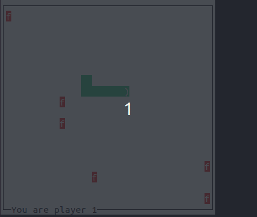

# SNAKES
Clients - Server Model, communication through  TCP/IP.

The project makes use of the ncurses library, which may be installed on a Debian system by running the command `sudo apt-get install libncurses5-dev libncursesw5-dev` . A make file is also included for easy compilation using the `make` command, and two binaries will be produced: `server` and `client`.

The socket port is set to 6969, as defined by `#define PORT 6969`. To run the server, simply enter `./server` in the command line. To start a client, enter the command `./client <ip address>`, where `<ip address>` is a placeholder for any IP address that the server resolves to from the AF_INET family of addresses. The desired IP address can be found by running the `ifconfig` command.

