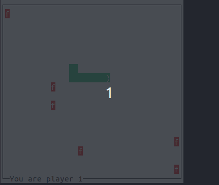

# SNAKES
Clients - Server Model, communication through  TCP/IP.




Developed by Andre Vella in fulfilment of unit [CPS2008]: https://www.um.edu.mt/courses/studyunit/CPS2008
- The project was compiled on multiple debian-based systems
(POP-OS,UBUNTU,LINUX-MINT) and makes use of the ncurses library.

- ncurses can be installed on a debian system by running the command:
```sudo apt-get install libncurses5-dev libncursesw5-dev```
A make file is included for easy compilation (compile using ```make```
command).

- 2 binaries will be produced: server & client.
- Socket port is set to 6969 (#define PORT 6969).
- To run the server run ```./server```. To start a client run command
```./client <ip address>```. Where the <ip address> is a place holder
of any IP-address that the server resolves to from the AF_INET family
of addresses. (find desired ip by running ```ifconfig```)


- Enjoy :)
